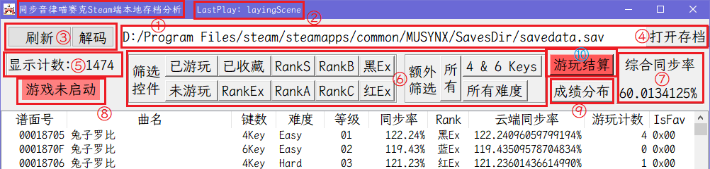
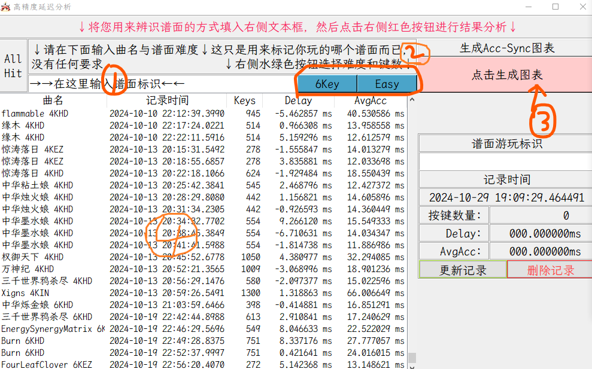
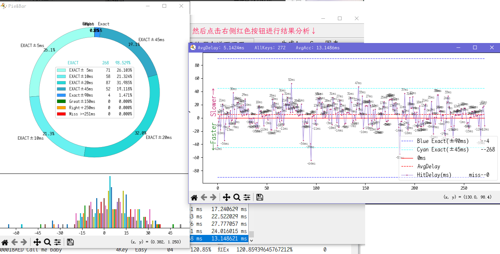
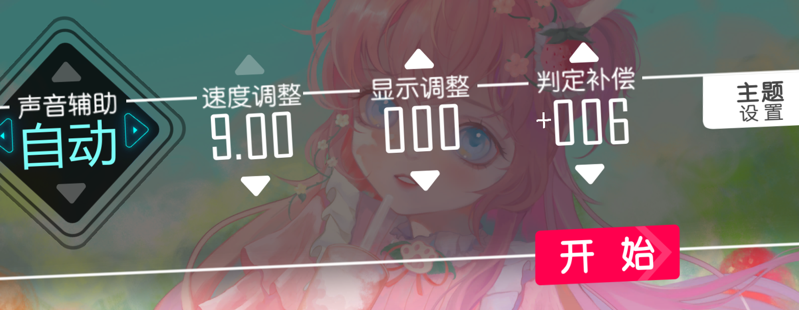

# How to use (v1.2.6 rc2)

## 菜单
[steamlink]: https://store.steampowered.com/app/952040/_/
本程序为Steam游戏[`同步音律喵赛克`][steamlink]的非官方插件，用于对游戏本体进行功能扩展。
1. [存档解析](#启动页)
2. [谱面筛选](#)
3. [谱面成绩筛选](#)
4. [一键启动游戏(Steam接口)](#)
5. [成绩-难度分布图](#)
6. [谱面游玩详情](#)
	- 所有点击在-150~+250ms中的`分布柱状图`
	- 对`分布柱状图`的正态曲线拟合
	- 所有点击在-150~+250ms中的`饼状图`
	- 一键获取控制台中的点击记录
	- 历史记录展示
	- 修改历史记录名称
7. 更多...

## 要求
1. 系统：仅限于Windows端使用
2. 客户端：针对Steam平台开发，Epic平台未测试

## 获取本程序
[release]: https://github.com/Ginsakura/MUSYNCSave/releases
[requirements]: https://github.com/Ginsakura/MUSYNCSave/blob/main/requirements.txt
1. 从[release页面][release]下载

    [latest_prerelease_svg]: https://img.shields.io/github/v/release/ginsakura/MUSYNCSave?display_name=release&label=Latest%20PreRelease&include_prereleases
    [all_tags]: https://github.com/Ginsakura/MUSYNCSave/tags
    [![Latest tag][latest_prerelease_svg]][all_tags]

    [latest_release_svg]: https://img.shields.io/github/v/release/ginsakura/MUSYNCSave?display_name=release&label=Latest%20Release
    [release]: https://github.com/Ginsakura/MUSYNCSave/releases
    [![latest release][latest_release_svg]][release]

2. 从源码编译：

	编译环境：Python 3.11.5, [requirements.txt][requirements]

	- 无命令行的散包：
	```cmd
	pyinstaller --distpath ./NoCLI/ -D -i ./musync_data/Musync.ico ./Launcher.py -w
	```
	- 无命令行的单exe文件：
	```cmd
	pyinstaller --distpath ./ -F -i ./musync_data/Musync.ico ./Launcher.py -w
	```
	- 带命令行的散包：
	```cmd
	pyinstaller --distpath ./WithCLI/ -D -i ./musync_data/Musync.ico ./Launcher.py
	```
	- 带命令行的单exe文件：
	```cmd
	pyinstaller --distpath ./ -F -i ./musync_data/Musync.ico ./Launcher.py
	```

## 功能介绍
### 启动页
#### 头部



① 本程序标题

② 存档中解析出的上次游玩

③ 刷新与解码存档文件，绑定`F5`按键 (~~$\color{Red}{实际上两个按钮功能相似}$~~ 新版已合并)

④ 存档地址文本与从文件管理器中选取按钮

⑤ 对下方筛选出的谱面进行计数，无筛选时即为所有谱面

⑥ 对谱面进行筛选，`筛选控件`为激活按钮，只有`激活`与`不激活`两种状态，

`额外筛选`为切换按钮，从↖到↘分别有三种、三种、四种状态进行`循环切换`

⑦ 通过下方筛选过的谱面计算综合同步率

⑧ 游戏启动监测，游戏启动时会自动变成绿色，红色时点击可通过steam接口(`steam://rungameid/952040`)启动游戏

⑨ 成绩分布窗口，使用matlablib绘制，通过读取存档内所有谱面的成绩生成散点图，通过散点计算平均值折线图

⑩ 通过修改客户端DLL文件实现更高级、更深层次的功能添加，修改的代码放置于`CSharp Code`文件夹

#### 窗体

①②③④⑤⑥⑦⑧⑨⑩

## 游玩结算界面[WIP]
1. 找到"musync_data\ExtraFunction.cfg"文件，用记事本打开
2. 修改"EnableDLLInjection"，把后面的false改成true
3. 启动程序，就能看到右上角有个红色按钮

然后就进游戏里游玩，玩的时候会弹出一个命令框，这个东西别关，一关游戏也跟着退了
玩完之后按照顺序填写①，切换②，点击③，结果会出现在④中


然后就会生成一个折线图窗口和一个环形图+柱状图的窗口


后面窗口就会出现一条新的记录，(上面窗口的④)
曲名列显示的是你输入的①和②总共五个列，
分别是
- 曲名：曲目和难度标识
- 时间：点击“点击生成图表”按钮的时间
- Keys：这个谱面有多少个Note，也就是需要按下多少次，一个Hold(长条)算一次
- Delay：你在±45ms/±90ms区间内平均的点击偏移，注意这个是平均值
- AvgAcc：就是其他音游里的Acc，所有点击的绝对值的平均值，与SYNC.Rate是负相关的，这个值越小越好，

122%的Acc普遍在13.5以下，这个要看你的精度

接下来是偏移修正

前面假设你已经玩了一把，得到了Delay的值，

接下来在游戏中，点击谱面，进入准备阶段


然后看判定补偿这一项

Delay显示多少，就对应调整多少

假设你最后一次玩的Delay是12.475134ms

那就在判定补偿上+12

如果是-7.531ms，那就减7

不过不是严格按照这个值去变

玩过几次之后电脑只要没有运行什么消耗资源的软件，

延迟基本上不会有太大的波动

如果某次Delay很离谱，可以向delay方向变动1/2的数值大小，

基本上可以凭经验比如我平常就是+6的延迟

某次游玩Delay是+8，我一般就习惯+3~6
