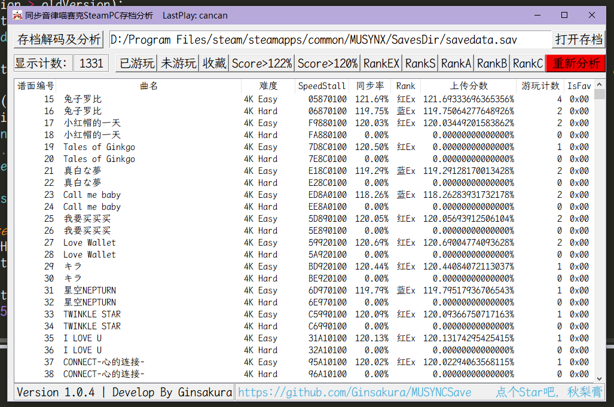

# 同步音律喵赛克 Steam端 存档解析工具
## 界面展示

## 更新日志
### Version 1.0.3
1. #### 更新 "SongName.json"文件
2. #### 新增 启动状态指示Label

### Version 1.0.2
2. #### 更改 窗口宽高自动识别频率为200ms
1. #### 新增 新版本提示颜色闪烁，改变时间为500ms
3. #### 新增 自动从GitHub Repo获取"./SongName.json"文件
4. #### 新增 自动从"FileExport.py"释放"霞鹜文楷等宽"字体和图标文件

### Version 1.0.1
1. #### 新增 开发者Label和更新获取通道
1. #### 新增 前往GitHub页面的Button
1. #### 新增 第二次及之后的分析会自动读取"./SavAnalyze.json"分析缓存
1. #### 新增 通过读取"./SongName.json"来填充"./SavAnalyze.json"中`SongName`字段

### Version 1.0.0
1. #### 新增 简易自动搜索存档文件
    首次运行时自动搜索每个磁盘的
    1. `./Program Files/steam/steamapps/common/MUSYNX/SavesDir/savedata.sav`
    2. `./SteamLibrary/steamapps/common/MUSYNX/SavesDir/savedata.sav`
    3. `./steam/steamapps/common/MUSYNX/SavesDir/savedata.sav`
    三个目录
2. #### 新增 可以按固定方式筛选谱面
    1. `筛选出 已游玩`
    2. `筛选出 未游玩`
    3. `筛选出 已收藏`
    4. `筛选出 成绩大于122%(即黑EX)`
    5. `筛选出 成绩大于120%(即红EX)`
    6. `按Rank评级: EX、S、A、B、C筛选`
3. #### 新增 允许使用"打开存档"按钮进行文件选择
4. #### 新增 显示当前已筛选出的谱面数量
5. #### 新增 使用红色"重新分析"按钮清除分析缓存并重新生成
6. #### 新增 窗口控件自动跟随窗口大小改变
7. #### 新增 在窗口标题栏显示最后一次游玩曲名