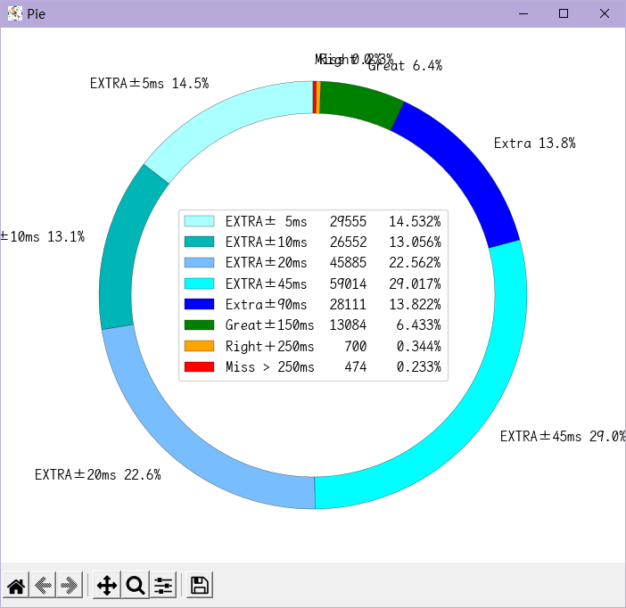

# 同步音律喵赛克 Steam端 存档解析工具
## 界面展示

## 未来的计划
- [ ] 提供全球排行榜显示功能
- [ ] 将提供一个文档来演示使用方法
- [ ] 使用文件夹内指定文件名的方式自定义美化UI
- [ ] 使用workflow功能实现自动生成分发版本
### 已完成的计划
- [x] 重排版SongName.json
- [x] 滑动条在重加载后保持位置不变
- [x] 隐藏cmd窗口
- [x] 将像Windows资源管理器一样使用列标题栏进行排序
- [x] 将高级功能整合为`ExtraFunction.cfg`配置文件

## Release版本说明
NoConsole版本为没有命令提示符界面，适合正常使用

WithConsole版本为带命令提示符界面，适合出现bug时快速定位错误发生地点以及原因

### 功能控制模块
于`./musync_data/ExtraFunction.cfg`文件中启用/禁用对应功能
1. `DisableCheckUpdate` 禁用更新检测
2. `EnableAnalyzeWhenStarting` 启用每次启动时强制重新扫描存档文件
3. `EnableDLLInjection` 启用DLL注入以开启高级功能
5. `EnableAcc-Sync` 启用Acc-Synx图表

 其他功能组件
下列组件对游戏客户端有修改,请谨慎使用

*** $\color{Red}{ 注意备份 注意备份 注意备份 }$ ***

$\color{Red}{请自行决定是否使用,使用过程中出现任何意外}$ *** $\color{Red}{ 后果自负,开发者概不负责 }$ ***

HitDelay模块用法:启用DLL注入后,在本次游戏进行首次谱面游玩时会打开一个cmd窗口 *** $\color{Red}{请勿关闭该窗口}$ ***

- `HitDelayFix.dll` 被精心修改过的客户端文件,原始文件为`./MUSYNX_Data/Managed/Assembly-CSharp.dll`,如果想要使用,复制替换即可(记得备份原始文件).
- `HitDelayLine.py` 用于读取`./musync_data/HitDelay.log`中的击打信息生成可视化数据表,标题栏提供三个统计信息.
    - `AvgDelay` 平均击打延迟,即所有击打的平均值,能够一定程度上提示游戏延迟应该调整的数值(可能有较大偏差,仅供参考).
    比如游戏内判定补偿是+010ms,AvgDelay数值为-5ms,那么就应将游戏内判定补偿下调,但是具体需要调整多少请多次测试.
    - `AllKeys` 游戏进行了多少次判定,如果有长条中断,这个值会比游戏内真实按键数偏大.
    - `AvgAcc` 平均击打偏差,即所有击打的绝对值的平均值,该值总为正数.
    该值反应了您当前谱面本次游玩击打Key的时机的精准度,该值与您本次游玩的结算成绩有一定的关联:

    该值越小,就说明您击打的越精准,(在该值小于45ms时，您的)分值就会越高.

## 更新日志
### Version 1.1.9
1. 更新 于`HitDelay`模块处更新Acc-Sync分析功能
2. 更新 于`AllHitAnalyze`模块处更新tap的Rate环形图
3. 更新 于`HitDelay`模块处更新tap的Rate环形图，若CyanExtra比例大于60%，则使用精细分级，若小于60%，则使用普通分级。
4. 更新 配置文件中增加更多的配置项：默认不开启上述两个环形图
5. 修复 修复`songname.json`中`惊涛落日 IN`谱面难度评级未更新的bug
<del>这玩意儿算bug吗？</del>

6. 修复 修复些许文案错误
7. 修复 修复多次点击`HitDelay`模块中的`AllHit`按钮时AllHitAnalyze图表显示错误的bug
8. 修复 对`AllHitAnalyze`模块中的正态曲线拟合数据范围进行修改
9. 修复 修复`HitDelay`模块中打开详细折线图时无法打开环形图的bug
10. 修复 修复了大于rc9的版本被识别为小于rc9的bug
11. 优化 修改图表字体为`霞鹜文楷等宽`
12. 优化 优化部分按钮提示词
13. 优化 对`AllHitAnalyze`模块中的环形图使用更加细化的Rate分级：将Cyan Extra分成`±5ms内、±6~10ms、±11~20ms、±21~45ms`四段
14. 优化 将额外功能修改为配置文件形式，放置于`./musync_data/ExtraFunction.cfg`
15. 优化 微调环形图
10. 优化 对系统DPI非100%的情况进行兼容优化
11. 优化 对`AllHitAnalyze`模块中的环形图计算流程进行优化，同时将优化应用于`HitDelay`模块中的环形图
12. 优化 替换部分源码文件中的缩进符号
13. 优化 对`AllHitAnalyze`模块中的正态曲线新增仅cyanExtra Rate拟合，须手动在配置文件中启用
20. 优化 对Update组件使用多线程，减少程序启动时的更新卡顿

### Version 1.1.8
1. 更新 适配本体*劳动节更新*
2. #### 更新 更新本次喵赛克更新的新曲目
    - luxianuz(EZ HD)
    - Four leaf clover(EZ HD)
    - 惊涛落日(IN)
    - diamond smile(IN)
    - platina(IN)
    - Sakura fubuki(IN)
    - supersonic(IN)
    - trojan(IN)
    - when you are away(IN)
    - 人里に下ったアタイがいつの間にか社畜にな(IN)
1. 优化 在`AllHitAnalyze`的标题栏中,新增各个评级的统计数字.
1. 优化 在`AllHitAnalyze`中,新增仅对Extra评级进行拟合曲线(黑色实线),原对所有数据进行拟合的曲线变更为黑色虚线
2. 优化 在`AllHitAnalyze`中,标签栏新增正态分布的方差与标准差的数值显示
2. 优化 优化`Readme.md`排版.
3. 优化 更详细的控制台输出

### Version 1.1.7
1. 更新 更新本次喵赛克更新的新曲目
      - 黄老饼梦游惊奇(EZ HD)
      - 惊涛落日(愚人节IN)
2. 更新 对更新的DLL文件进行适配
3. 更新 对延迟图表的Label增加评级统计
3. 更新 新增一个统计所有击打的延迟的柱状图，在延迟分析页面的"All Hit"按钮
4. 更新 在`AllHitAnalyze`中新增 ***正态分布曲线*** 计算(不过可能不准确)
4. 修复 修复了"未游玩"筛选没有正确实现的bug
5. 修复 修复了"红Ex"筛选中混杂"黑Ex"的bug
6. 修复 修复了`HitAnalyze`中关于打击延迟在(-1,1)之间全被统计为0的bug,现在负数方向统一 **减去一毫秒**
7. 修复 修复了"Rank C"筛选没有正确生效的bug
8. 修复 修复了无法打开文件选择窗口的bug <del>(我tm用错模块了🌿)</del>
6. 优化 提供散装发布文件与单发布文件两种，按需使用，没啥区别
7. 优化 优化打包发布环境，降低可执行文件的包大小至38MiB
8. 优化 优化了HitDelay模块中`AvgDelay`参数的计算方式
9. 优化 优化文件自动搜索流程
10. 优化 优化正态分布计算流程

### Version 1.1.6
1. 更新 将DLL注入与详细延迟图表功能整合进主程序中，需要您具备一定的计算机操作能力才可启用
2. 更新 加大了表格内的字体大小，更护眼了
3. 更新 您的历史游玩记录可以在`./musync_data/HitDelayHistory.db`中查看
1. 修复 修复了对DLL注入时写入错误数据的bug
3. 修复些许bug(也许?)
4. 优化执行流程(也许?)
5. <del>这次打包大小咋突然翻了三倍??? 又nm什么原理🌿??？</del>

### Version 1.1.5
1. 更新 修改排除空白谱面的函数，使其更加自动化
      - 已找出空白谱面的规律: 加入收藏后会在收藏曲目的6KHD难度的编号+9位置产生一个空白谱面
2. 更新 `songname.json`
      - 更新曲目: Chivalric
1. 修复 修复了对"游玩计数"排序功能无法正确排序的bug
2. 优化 修改少量函数名,使其更加贴近实现的功能
3. 优化 整合本地功能函数库
3. 修复少量bug
4. 优化执行流程

### Version 1.1.4 rc2
- [x] 滑动条在重加载后保持位置不变
1. 更新 排除空白谱面
2. 更新 补全当前版本所有SongName
3. 更新 增加版权到期排除谱面功能
  版权到期的曲目有：
    - 404 Not Found
    - ArroganT
    - TWINKLE STAR
    - 为你而来
    - 寓言预见遇见你的那刻
    - 星之伊始
    - 樂園 - Atlantis
    - 观星者
1. 更新 新增一个筛选按钮用于筛选谱面难度
    - (Easy | Hard | Inferno | All)
    - 默认为All
2. 更新 新增一个筛选按钮用于筛选谱面按键数
    - (4K | 6K | 4K&6K)
    - 默认为4K&6K
2. 更新 新增一个Label将上述两个按钮包裹在内(伪装成一个Frame(bushi))
3. 优化执行流程
4. 修复些许bug
5. <del>这次打包咋小了一半？？？什么原理🌿？</del>

### Version 1.1.3
- [x] 隐藏cmd窗口
- [x] 将像Windows资源管理器一样使用列标题栏进行排序
2. 更新 通过点击标题栏来进行排序显示
    - 升序:`▲`
    - 降序:`▼`
4. 更新 文件选择功能增加扩展名限制
5. 更新 `SongName.json`的内容
6. 更新 从GitHub下载`SongName.json`文件
7. 修复 修复等待状态栏不能正常使用的bug
3. 优化 将程序生成的文件放置于`./musnyc_data/`中,让可执行文件所在目录不显得那么杂乱
1. 优化 移除排序按钮
6. 更新 部分优化占用与卡顿
3. 修复 修复些许bug

### Version 1.1.2
2. 修复 修复了第一次启动时json文件报错的bug
1. 优化 发布可执行文件去掉了命令提示符框

### Version 1.1.1
1. 修复 修复某些bug
2. 优化 更改SongName数据表的键名
    - 将小端键名替换为大端
3. 优化 更改"未游玩"筛选的判定条件
    - 现在"未游玩"的判定条件为: 游玩计数和本地同步率同时为0

### Version 1.1.0
1. 优化 更改判定一条存储内容是哪首歌哪个谱面的方式
    - 已通过(本人的)多版本存档验证
    - 缺少更多的存档进行更多的测试
2. 优化 修改Json文件的内容

### Version 1.0.7
1. 更新 排除空谱面
  1. 排除0935号谱面ID 原因 该编号未被分配
  2. 排除1022号谱面ID 原因 该编号未被分配
  2. 排除1194号谱面ID 原因 该编号未被分配
  2. 排除1283号谱面ID 原因 该编号未被分配
  2. 排除1342及更高的谱面ID 原因 该编号未被分配
2. 修复 歌曲收藏功能异常
  游戏中"收藏"功能仅标记4K Easy难度，目前实现自动对其他难度在分析文件中同时添加标记
3. 修复 打开错误的`SavAnalyze.json`文件导致异常闪退的问题
  现在将会自动删除错误文件并重新生成
  如果生成错误，有可能会再次闪退

### Version 1.0.6
1. 更新 通过"云端同步率"计算"综合同步率"
2. 优化 排序控件
  1. "本地同步率"改为"云端同步率"
3. 优化 筛选控件
  1. "Score>122%"改为"黑Ex"
  2. "Score>120%"改为"红Ex"

### Version 1.0.5
1. 更新 谱面排序功能
    - 灰色(#F0F0F0)表示未启用该排序方法
    - 绿色(#98E22B)表示已启用该排序的倒序方法
    - 红色(#FF7B7B)表示已启用该排序的正序方法
  1. 按 游玩次数 排序
  2. 按 难度等级 排序
  3. 按 本地同步率 排序
  1. 按 名称 排序
2. 更新 谱面筛选按钮增加背景颜色启用标识
    - 灰色(#F0F0F0)表示未启用该筛选方法
    - 绿色(#98E22B)表示已启用该筛选方法
3. 更新 谱面筛选功能与谱面排序功能可同时使用
4. 优化 筛选控件与排序控件的排版大幅度改动

### Version 1.0.4
1. 更新 双击谱面打开新窗口爬取全球数据(未找到排行榜链接)
2. 更新 "SongName.json"文件
3. 更新 谱面难度等级列
3. 优化 谱面难度列分拆为"键数"列和"难度"列

### Version 1.0.3
1. 更新 "SongName.json"文件
2. 更新 启动状态指示Label

### Version 1.0.2
1. 更新 新版本提示颜色闪烁，改变时间为500ms
3. 更新 自动从GitHub Repo获取"./SongName.json"文件
4. 更新 自动从"FileExport.py"释放"霞鹜文楷等宽"字体和图标文件
2. 优化 窗口宽高自动识别频率为200ms

### Version 1.0.1
1. 更新 开发者Label和更新获取通道
1. 更新 前往GitHub页面的Button
1. 更新 第二次及之后的分析会自动读取"./SavAnalyze.json"分析缓存
1. 更新 通过读取"./SongName.json"来填充"./SavAnalyze.json"中`SongName`字段

### Version 1.0.0
1. 更新 简易自动搜索存档文件
  首次运行时自动搜索每个磁盘的
  1. `./Program Files/steam/steamapps/common/MUSYNX/SavesDir/savedata.sav`
  2. `./SteamLibrary/steamapps/common/MUSYNX/SavesDir/savedata.sav`
  3. `./steam/steamapps/common/MUSYNX/SavesDir/savedata.sav`
  三个目录
2. 更新 可以按固定方式筛选谱面
  1. `筛选出 已游玩`
  2. `筛选出 未游玩`
  3. `筛选出 已收藏`
  4. `筛选出 成绩大于122%(即黑EX)`
  5. `筛选出 成绩大于120%(即红EX)`
  6. `按Rank评级: EX、S、A、B、C筛选`
3. 更新 允许使用"打开存档"按钮进行文件选择
4. 更新 显示当前已筛选出的谱面数量
5. 更新 使用红色"重新分析"按钮清除分析缓存并重新生成
6. 更新 窗口控件自动跟随窗口大小改变
7. 更新 在窗口标题栏显示最后一次游玩曲名

### 再次申明：妾身`不会`对存档文件进行`写`操作