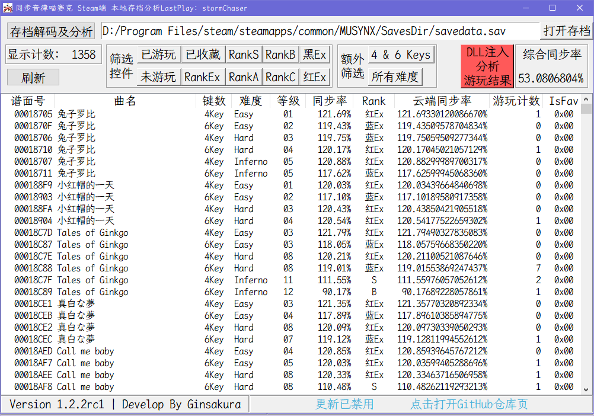
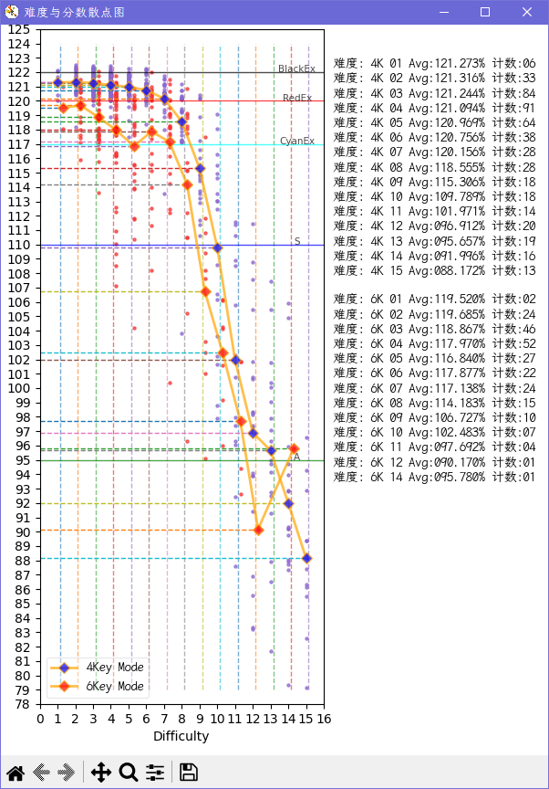
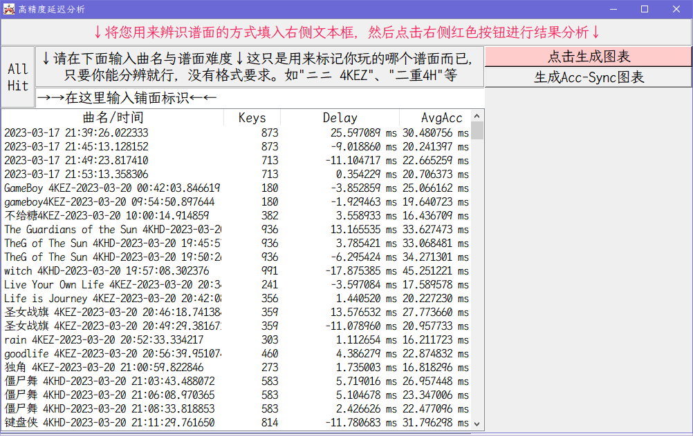
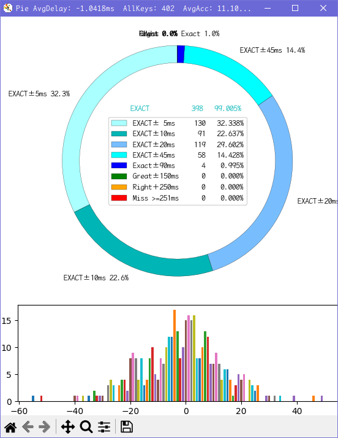
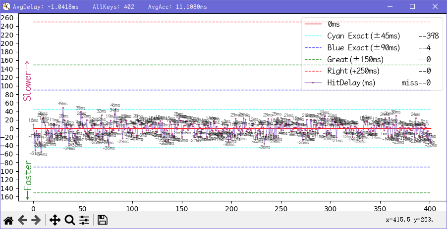
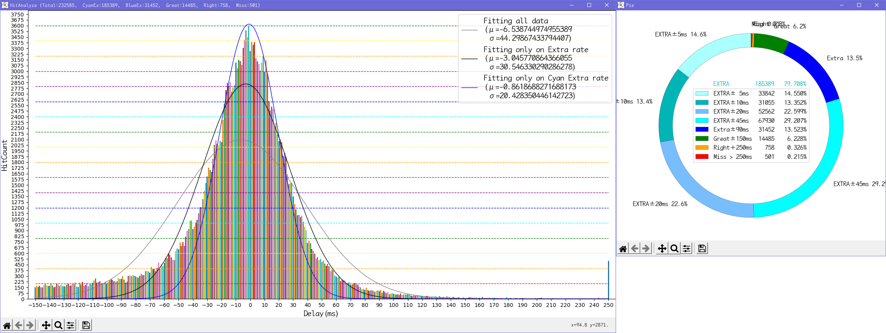
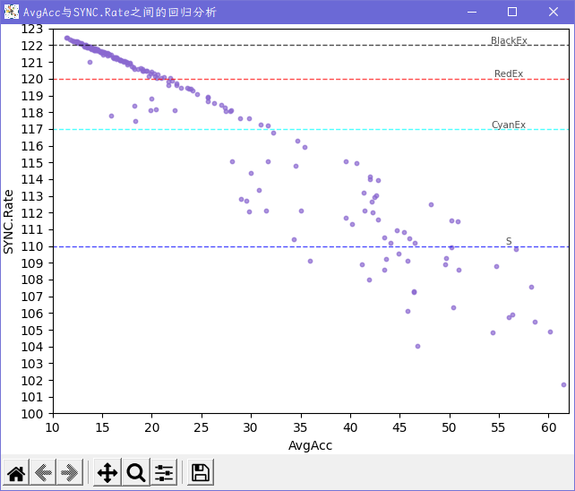

# 同步音律喵赛克 Steam端 存档解析工具
MUSYNX Steam Client Savefile Decode & Analyze Tool

## 界面展示

## 计划
### 未来的计划
- [ ] 提供全球排行榜显示功能 (需要调用SteamAPI)
- [ ] 将提供一个文档来演示使用方法 (在写了,咕咕咕)
- [ ] 使用文件夹内指定文件名的方式自定义美化UI
### 已完成的计划
- [x] 一键获取上次谱面游玩结果
- [x] 使用GitHub Action workflow实现自动分发
- [x] 重排版SongName.json
- [x] 滑动条在重加载后保持位置不变
- [x] 隐藏cmd窗口
- [x] 将像Windows资源管理器一样使用列标题栏进行排序
- [x] 将高级功能整合为`ExtraFunction.cfg`配置文件

## Release版本说明
NoConsole版本为没有命令提示符界面，适合正常使用

WithConsole版本为带命令提示符界面，适合出现bug时快速定位错误发生地点以及原因

## 功能控制模块
于`./musync_data/ExtraFunction.cfg`文件中启用/禁用对应功能
|               配置项              |     默认值    | 值类型 |                                配置说明                                |
|-----------------------------------|---------------|--------|------------------------------------------------------------------------|
| `EnableAcc-Sync`                  |false          |boolean |是否启用Acc-Synx图表                                                    |
| `DisableCheckUpdate`              |false          |boolean |是否禁用更新检测                                                        |
| `EnableAnalyzeWhenStarting`       |false          |boolean |是否启用每次启动时重新扫描存档文件                                      |
| `EnableDLLInjection`              |false          |boolean |是否启用DLL注入以开启`高级功能`                                         |
| `SystemDPI`                       |`自动获取`     |string  |读取系统DPI, 提供DPI窗体修正(未实现)                                    |
| `EnableDonutChartinHitDelay`      |false          |boolean |是否在单次游玩统计中显示击打延迟环形图                                  |
| `EnableDonutChartinAllHitAnalyze` |false          |boolean |是否在全局统计中显示击打延迟环形图                                      |
| `EnablePDFofCyanExact`            |false          |boolean |是否在全局统计中显示仅CyanExact的正态分布拟合                           |
| `EnableNarrowDelayInterval`       |true           |boolean |是否在单次游玩统计中使用更狭窄的击打区间来计算平均偏移值(Delay) [true=45ms,false=90ms]|
| `ConsoleAlpha`                    |75             |int     |喵赛克游戏本体控制台窗口的不透明度 (取值范围[0,100],100为完全不透明,不建议取值在30以下)|
| `ConsoleFont`                     |'霞鹜文楷等宽' |string  |喵赛克游戏本体控制台窗口的字体                                          |
| `ConsoleFontSize`                 |36             |int     |喵赛克游戏本体控制台窗口的字号                                          |
| `MainExecPath`                    |`自动获取`     |string  |喵赛克游戏本体主程序所在的路径                                          |
| `ChangeConsoleStyle`              |false          |boolean |是否启用自定义喵赛克游戏本体控制台窗口样式                              |
| `EnableFramelessWindow`           |false          |boolean |是否启用无边框窗口样式(未完成)                                          |
| `TransparentColor`                |'#FFFFFF'      |string boolean |设置透明色(仅限新样式) 设置为false即为关闭透明色           |
| `DefaultKeys`                     |false          |boolean |`高级功能`中默认`键数`参数                                              |
| `DefaultDiffcute`                 |0              |int     |`高级功能`中默认`难度`参数                                              |

### 高级功能简介
下列组件对游戏客户端有修改,请谨慎使用

$\color{Red}{*** 注意备份 注意备份 注意备份 ***}$

$\color{Red}{请自行决定是否使用,使用过程中出现任何意外}$
$\color{Red}{后果自负,开发者概不负责}$

HitDelay模块用法:启用DLL注入后,在本次游戏进行首次谱面游玩时会打开一个cmd窗口 $\color{Red}{请勿关闭该窗口}$

- `HitDelayFix.dll` 被精心修改过的客户端文件,原始文件为`./MUSYNX_Data/Managed/Assembly-CSharp.dll`.
- `HitDelayLine.py` 用于读取`./musync_data/HitDelay.log`中的击打信息生成可视化数据表,标题栏提供三个统计信息.
    - `AvgDelay` 平均击打延迟,即所有击打的平均值,能够一定程度上提示游戏延迟应该调整的数值(可能有较大偏差,仅供参考).
    比如游戏内判定补偿是+010ms,AvgDelay数值为-5ms,那么就应将游戏内判定补偿减少5ms,但是具体需要调整多少请多次测试.
    - `AllKeys` 谱面中存在note的数目.
    - `AvgAcc` 平均击打偏差,即所有击打的绝对值的平均值,该值总为正数.
    该值反应了您当前谱面本次游玩击打Key的时机的精准度,该值与您本次游玩的结算成绩有一定的关联:

    该值越小,就说明您击打的越精准,(在该值小于45ms时，您的)分值就会越高.

## 更新日志
<!--
### Version 
#### Release 
1. 更新
    1. xxx
2. 修复
    1. xxx
3. 优化
    1. xxx
-->
### Version 1.2.6
#### Release 2
1. 更新
    1. 修补新的Assembly-CSharp.dll
    2. 使用新的md结构用于展示版本更新内容
2. 修复
    1. 修复Delay中默认数值无法载入的bug
3. 优化
#### Release 1
1. 更新
    1. #### ***更新02月08日喵赛克新增曲目 (新春超大份更新)***
        - Maholova (EZ HD IN)
        - Inverted World (EZ HD IN)
        - Shooting☆Stars (EZ HD IN)
        - Provison (EZ HD)
        - Lockdown(MUSYNX edit.) (EZ HD)
        - Shizuku (ft. NEONA & KOTONOHOUSE) (EZ HD)
        - Bison Charge(MUSYNX Update) (EZ HD IN)
        - opia -awakened- (MUSYNC edit.) (EZ HD IN)
        - quia desolatio (EZ HD IN)
        - Xigns (EZ HD IN)
2. 修复
    1. 修复ci中requirement安装失败的bug
3. 优化
    1. 优化C#代码中的判断流程
    2. 优化`songname.json`的格式 (20231229 -> 20230118)
    3. 优化ci执行流程

### Version 1.2.5
#### Release 6
1. 更新
    1. #### ***更新12月29日喵赛克新增曲目 (元旦节更新)***
        - Flammable (EZ HD IN)
2. 修复
    1. 修复`AllHitDelay`中环形图Legend显示错误的bug
3. 优化
    1. 优化部分UI布局
    2. 优化绘图部分程序逻辑
    3. 优化绘图样式与展示
    4. 优化主页谱面排序规则：`顺序优先 -> 逆序优先`
    5. 主页面双击谱面能够在控制台输出谱面信息
#### Release 5
1. 更新
    1. #### ***更新12月22日喵赛克新增曲目 (圣诞节更新)***
        - fallin' fallin' (EZ HD)
        - Cross†Destination (EZ HD)
        - Don't Never Around (EZ HD IN)
        - Eschatology (EZ HD IN)
        - Revival of Kalpa (EZ HD IN)
3. 优化
    1. 优化`HitDelay`中柱状图x轴间隔
#### Release 4
1. 更新
    1. 提供DPI锁定，使得界面不会随着系统DPI设置而导致UI显示错误
    2. #### ***更新11月01日喵赛克新增曲目 (万圣节更新)***
        - spooky mummy party (EZ HD)
2. 修复
    1. 修复`Readme`中的链接错误
    2. 修复配置项中的SystemDPI无法正确更新的bug
#### Release 3
2. 修复
    1. 修复图片资源缺失的bug
3. 优化
    1. 优化字节读取
#### Release 2
1. 更新
    1. `HitDelay`模块中`tap的Rate环形图`中新增柱状图子图
2. 修复
    1. 修复`HitDelay`模块中更改、删除记录时删除所有同名记录的bug
3. 优化
    1. 优化`HitDelay`中的折线图使其自适应显示记录中的最大值
#### Release 1
1. 更新
    1. #### ***更新9月28日喵赛克新增曲目 (国庆节更新)***
        - 中华少女·终 (EZ HD)
        - 夜月花 (EZ HD)
        - KiNG FORM -XIII- (2023 Update) (EZ HD IN)
        - Binary Star (EZ HD)
        - wish upon the polar star (EZ HD)

### Version 1.2.4
#### Release 7
1. 修复 修复主窗口频繁卡顿的bug
2. 修复 修复`songname.json`中的错误
1. 优化 将`HitDelayHistory.db`修改为`HitDelayHistory_v2.db`以易于判断存档版本
2. 优化 格式化导入库，格式化内链接
#### Release 6
1. 新增 新增关键函数执行CPU时长的控制台输出
1. 修复 修复无法释放资源的bug
2. 修复 修复`成绩分布散点图`中最低成绩大于某值后仍然显示该行的bug
3. 修复 修复游戏运行检测高频次执行的bug
1. 优化 优化版本更新判定
2. 优化 提供`Push但不构建`的Push参数
3. 优化 优化`成绩分布散点图`显示
#### Release 5
1. 修复 将所有文档中的`Extra`替换为`Exact`
1. 优化 `难度与成绩的散点分布图`中增加`难度-平均成绩`<ruby>线<rp>(</rp><rt>Plot</rt><rp>)</rp></ruby>
2. 优化 主界面对**`刷新`按钮**绑定**`F5`按键**
3. 优化 将修改客户端用的C#代码放于`CSharp Code`文件夹中
#### Release 4
1. 修复 修复移除曲目未被排除的bug
2. 修复 修复本体曲目不正确的bug
<del>顺便修复萌娘百科中某个曲目在本体与DLC中重复出现的bug</del>
3. 修复 修复`songname.json`中部分曲名大小写和曲名错误的问题
1. 优化 将License从GPLv3切换为MIT
#### Release 3
1. 更新 主界面提供`难度与成绩的散点分布图`
1. 修复 修复读取游玩历史记录时读取到错误时间的记录的bug
2. 修复 修复未输出`LICENSE`的bug
1. 优化 优化`难度与成绩的散点分布图`中图示与指示线的颜色、分布
2. 优化 主窗口UI调整：
    - 上调`刷新`按钮位置与`存档分析`按钮并排
    - 缩小`存档分析`按钮大小
    - 将`游戏运行检测`<ruby>标签<rp>(</rp><rt>Label</rt><rp>)</rp></ruby>移动到原`刷新`按钮的位置
    - 取消`关闭`按钮
    - 在原`游戏运行检测`<ruby>标签<rp>(</rp><rt>Label</rt><rp>)</rp></ruby>处放置`成绩分布`按钮
    - 将原`结果分析`按钮的文本改为`游玩结算`
3. 优化 将散点图函数重命名
#### Release 2
1. 修复 修复游玩结算时对CyanExact数量计算错误的bug
2. 修复 修复筛选Rank C时未游玩谱面未被排除的bug
3. 修复 修复未提交C++编译脚本的bug
#### Release 1
1. 更新 提供一个快速启动Python源码的C++文件，并且提供作为编译示例的batch文件
2. 更新 点击游戏状态Label可以通过Steam快速启动游戏
1. 修复 将Python环境提升到3.11.5，修复了Python3.8.6中TreeView无法设置背景色、前景色的bug
1. 优化 将检测游戏是否启动的功能`多线程化`

### Version 1.2.3
1. 更新 对曲目新增DLC标记，用以标记曲目是否是DLC曲目
2. 更新 新增本体/DLC曲目筛选
3. #### 更新 更新本次喵赛克更新的新曲目
    - 日本式硬核 -Oukaranman-(EZ HD)
    - Euphoria(MUSYNX EDIT.)(EZ HD)
4. 更新 新增检测游戏是否启动
5. 更新 提供自动更新游玩记录数据库的功能，在程序启动时自动执行
$\color{Red}{更新后的数据库不向下兼容}$
1. 修复 修复更新提示报错的bug
2. 修复 修复 `SongName.json` 资源未被封装进程序的bug
3. 修复 修复 `AllHitAnalyze` 图表中对CyanExact统计错误的bug
1. 优化 优化曲目收藏修复函数的执行方式
2. 优化 将 `EnableNarrowDelayInterval` 配置项默认值修改为 `true`
3. 优化 点击更新提示时将会直接跳转到最新版的单独tag release页面
4. 优化 将游玩记录数据库中，名称列中的记录时间拆分为单独的列，并单独显示

### Version 1.2.2
1. 更新 通过使用UIAutoMation库实现一键自动从控制台获取游玩结果 
    <del>以后都不需要再Ctrl A+C+V了</del>
    $\color{Red}{控制台只显示最近一次的游玩记录，请在下次谱面游玩开始前生成结果}$
    $\color{Red}{控制台关闭后不会保存游玩记录，请在关闭游戏前生成结果}$
    $\color{Red}{结果生成需要使用剪切板，点击按钮后，在结果生成前请不要进行任何复制操作}$
2. 更新 `HitDelay` 窗口中新增详细游玩记录展示
3. 更新 `HitDelay` 窗口中新增支持修改谱面游玩标识
4. 更新 `HitDelay` 窗口中新增支持删除谱面游玩记录
5. 更新 `HitDelay` 窗口中删除谱面前产生提示框
6. 更新 提供无边框窗口样式
7. 更新 新增配置项: `EnableFramelessWindow`,`TransparentColor`
8. 更新 新的Acc-Sync分析数据格式化模块，使用Stata进行数据分析
1. 修复 修复编译环境缺少 `uiautomation` 库的bug
2. 修复 修复`./skin/`找不到的bug <del>历史遗留问题呜呜呜呜呜</del>
3. 修复 修复首次启动时没有自动打开字体安装程序的bug
4. 修复 修复当没有 `SaveFilePath.sfp` 文件，但是 `EnableAnalyzeWhenStarting` 配置项为 `true` 时引发报错的bug
5. 修复 修复 `HitDelay` 中获取的游玩成绩最后一次击打被过滤的bug
6. 修复 修复 `HitDelay` 中向数据库发送指令时包含`'`字符时崩溃的bug
7. 修复 修复 `HitDelay` 中向数据库发送删除指令时崩溃的bug
1. 优化 重新调整 `HitDelay` 窗口的布局
2. 优化 谱面标识输入框新增提示，输入框获取焦点时自动删除提示词，键入标识后不会自动删除
3. 优化 降低首页DLL注入按钮的饱和度，使其醒目但不那么刺眼
4. 优化 优化首页元素布局方式 <del>Frame，好用)</del>
5. 优化 优化 `Readme.md` 中有关配置文件的布局 <del>表格,好看)</del>
6. 优化 不再从GitHu获取`SongName.json`文件
7. 优化 当程序报错时，不会直接退出控制台，而是保留控制台显示报错信息
8. 优化 `HitDelay` 窗口中当Entry控件中的值为空时，弹出提示框
9. 优化 表格刷新时滚动条的状态改变更平滑
10. 优化 优化readme中的表格
11. 优化 自动将`GBK`编码的配置文件更新为`UTF-8`编码
13. 优化 优化曲名排序规则：不再区分大小写
14. 优化 `HitDelay` 窗口中，微调Treeview布局
15. 优化 `HitDelay` 窗口中，自动将滚动条置于底端，记录更新时自动滚动到新的最底端

### Version 1.2.1
1. 更新 针对喵赛克本体游玩时的Console进行优化，新增配置项
    - `ConsoleAlpha` : 控制台透明度,建议设置为65~75,取值范围[0,100],默认75
    - `ConsoleFont` : 控制台字体,默认`霞鹜文楷等宽`   <del>这个字体明明挺好看的(逃)</del>
    - `ConsoleFontSize` : 控制台字号,取值一般为20,24,28,36, 默认36
    - `MainExecPath` : 喵赛克主程序所在路径,会由程序自动填写,可手动修改
    - `ChangeConsoleStyle` : 是否启用控制台样式修改,布尔类型,默认为false
   本项更新涉及注册表操作,本人测试正常,使用时还请提前添加系统还原点,启动一次本程序确认不会造成损害后可删除还原点, 第一次启动没有事之后就不会有事(除非你喵赛克换路径了)
2. 更新 对DLL注入进行更新,本次更新后将支持谱面开始游玩时自动清空控制台  <del>放心大胆的Ctrl A吧!  ε=ε=ε=┏(゜ロ゜;)┛</del>
4. 修复 多次重复打开 `AllHitAnalyze` 图表时，在图表内重叠显示内容的bug，本版本之后会转变成刷新图表
3. 优化 因为自动清空控制台,所以分割gamestart的函数被移除.
4. 优化 GitHubAction中版本标识的传递方法

### Version 1.2.0
1. 更新 适配本体*端午节更新*
2. #### 更新 更新本次喵赛克更新的新曲目
    - BiBiC Heart(EZ HD)
    - Brain Crash(EZ HD IN)
    - Saintelmo(EZ HD IN)

### Version 1.1.9
1. 更新 于`HitDelay`模块处更新Acc-Sync分析功能
2. 更新 于`AllHitAnalyze`模块处更新tap的Rate环形图
3. 更新 于`HitDelay`模块处更新tap的Rate环形图，若CyanExact比例大于60%，则使用精细分级，若小于60%，则使用普通分级。
4. 更新 配置文件中增加更多的配置项：默认不开启上述两个环形图
5. 修复 修复`songname.json`中`惊涛落日 IN`谱面难度评级未更新的bug
    <del>这玩意儿算bug吗？</del>

6. 修复 修复些许文案错误
7. 修复 修复多次点击`HitDelay`模块中的`AllHit`按钮时AllHitAnalyze图表显示错误的bug
8. 修复 对`AllHitAnalyze`模块中的正态曲线拟合数据范围进行修改
9. 修复 修复`HitDelay`模块中打开详细折线图时无法打开环形图的bug
10. 修复 修复了大于rc9的版本被识别为小于rc9的bug
11. 修复 修复了RankC评级筛选包含成绩为0%的谱面的bug
12. 修复 修复了版本识别错误的bug(再次)
13. 修复 修复了`HitDelay`模块中CyanExact评级少于50%时引发报错的bug
11. 优化 修改图表字体为`霞鹜文楷等宽`
12. 优化 优化部分按钮提示词
13. 优化 对`AllHitAnalyze`模块中的环形图使用更加细化的Rate分级：将Cyan Exact分成`±5ms内、±6~10ms、±11~20ms、±21~45ms`四段
14. 优化 将额外功能修改为配置文件形式，放置于`./musync_data/ExtraFunction.cfg`
15. 优化 微调环形图
10. 优化 对系统DPI非100%的情况进行兼容优化
11. 优化 对`AllHitAnalyze`模块中的环形图计算流程进行优化，同时将优化应用于`HitDelay`模块中的环形图
12. 优化 替换部分源码文件中的缩进符号
13. 优化 对`AllHitAnalyze`模块中的正态曲线新增仅cyanExact Rate拟合，须手动在配置文件中启用
20. 优化 对Update组件使用多线程，减少程序启动时的更新卡顿
21. 优化 优化布局
22. 优化 提供两段Delay分析

### Version 1.1.8
1. 更新 适配本体*劳动节更新*
2. #### 更新 更新本次喵赛克更新的新曲目
    - luxianuz(EZ HD)
    - Four leaf clover(EZ HD)
    - 惊涛落日(IN)
    - diamond smile(IN)
    - platina(IN)
    - Sakura fubuki(IN)
    - supersonic(IN)
    - trojan(IN)
    - when you are away(IN)
    - 人里に下ったアタイがいつの間にか社畜にな(IN)
1. 优化 在`AllHitAnalyze`的标题栏中,新增各个评级的统计数字.
1. 优化 在`AllHitAnalyze`中,新增仅对Exact评级进行拟合曲线(黑色实线),原对所有数据进行拟合的曲线变更为黑色虚线
2. 优化 在`AllHitAnalyze`中,标签栏新增正态分布的方差与标准差的数值显示
2. 优化 优化`Readme.md`排版.
3. 优化 更详细的控制台输出

### Version 1.1.7
1. 更新 更新本次喵赛克更新的新曲目
      - 黄老饼梦游惊奇(EZ HD)
      - 惊涛落日(愚人节IN)
2. 更新 对更新的DLL文件进行适配
3. 更新 对延迟图表的Label增加评级统计
3. 更新 新增一个统计所有击打的延迟的柱状图，在延迟分析页面的"All Hit"按钮
4. 更新 在`AllHitAnalyze`中新增 ***正态分布曲线*** 计算(不过可能不准确)
4. 修复 修复了"未游玩"筛选没有正确实现的bug
5. 修复 修复了"红Ex"筛选中混杂"黑Ex"的bug
6. 修复 修复了`HitAnalyze`中关于打击延迟在(-1,1)之间全被统计为0的bug,现在负数方向统一 **减去一毫秒**
7. 修复 修复了"Rank C"筛选没有正确生效的bug
8. 修复 修复了无法打开文件选择窗口的bug <del>(我tm用错模块了🌿)</del>
6. 优化 提供散装发布文件与单发布文件两种，按需使用，没啥区别
7. 优化 优化打包发布环境，降低可执行文件的包大小至38MiB
8. 优化 优化了HitDelay模块中`AvgDelay`参数的计算方式
9. 优化 优化文件自动搜索流程
10. 优化 优化正态分布计算流程

### Version 1.1.6
1. 更新 将DLL注入与详细延迟图表功能整合进主程序中，需要您具备一定的计算机操作能力才可启用
2. 更新 加大了表格内的字体大小，更护眼了
3. 更新 您的历史游玩记录可以在`./musync_data/HitDelayHistory.db`中查看
1. 修复 修复了对DLL注入时写入错误数据的bug
3. 修复些许bug(也许?)
4. 优化执行流程(也许?)
5. <del>这次打包大小咋突然翻了三倍??? 又nm什么原理🌿??？</del>

### Version 1.1.5
1. 更新 修改排除空白谱面的函数，使其更加自动化
      - 已找出空白谱面的规律: 加入收藏后会在收藏曲目的6KHD难度的编号+9位置产生一个空白谱面
2. 更新 `songname.json`
      - 更新曲目: Chivalric
1. 修复 修复了对"游玩计数"排序功能无法正确排序的bug
2. 优化 修改少量函数名,使其更加贴近实现的功能
3. 优化 整合本地功能函数库
3. 修复少量bug
4. 优化执行流程

### Version 1.1.4 rc2
- [x] 滑动条在重加载后保持位置不变
1. 更新 排除空白谱面
2. 更新 补全当前版本所有SongName
3. 更新 增加版权到期排除谱面功能
  版权到期的曲目有：
    - 404 Not Found
    - ArroganT
    - TWINKLE STAR
    - 为你而来
    - 寓言预见遇见你的那刻
    - 星之伊始
    - 樂園 - Atlantis
    - 观星者
1. 更新 新增一个筛选按钮用于筛选谱面难度
    - (Easy | Hard | Inferno | All)
    - 默认为All
2. 更新 新增一个筛选按钮用于筛选谱面按键数
    - (4K | 6K | 4K&6K)
    - 默认为4K&6K
2. 更新 新增一个Label将上述两个按钮包裹在内(伪装成一个Frame(bushi))
3. 优化执行流程
4. 修复些许bug
5. <del>这次打包咋小了一半？？？什么原理🌿？</del>

### Version 1.1.3
- [x] 隐藏cmd窗口
- [x] 将像Windows资源管理器一样使用列标题栏进行排序
2. 更新 通过点击标题栏来进行排序显示
    - 升序:`▲`
    - 降序:`▼`
4. 更新 文件选择功能增加扩展名限制
5. 更新 `SongName.json`的内容
6. 更新 从GitHub下载`SongName.json`文件
7. 修复 修复等待状态栏不能正常使用的bug
3. 优化 将程序生成的文件放置于`./musnyc_data/`中,让可执行文件所在目录不显得那么杂乱
1. 优化 移除排序按钮
6. 更新 部分优化占用与卡顿
3. 修复 修复些许bug

### Version 1.1.2
2. 修复 修复了第一次启动时json文件报错的bug
1. 优化 发布可执行文件去掉了命令提示符框

### Version 1.1.1
1. 修复 修复某些bug
2. 优化 更改SongName数据表的键名
    - 将小端键名替换为大端
3. 优化 更改"未游玩"筛选的判定条件
    - 现在"未游玩"的判定条件为: 游玩计数和本地同步率同时为0

### Version 1.1.0
1. 优化 更改判定一条存储内容是哪首歌哪个谱面的方式
    - 已通过(本人的)多版本存档验证
    - 缺少更多的存档进行更多的测试
2. 优化 修改Json文件的内容

### Version 1.0.7
1. 更新 排除空谱面
  1. 排除0935号谱面ID 原因 该编号未被分配
  2. 排除1022号谱面ID 原因 该编号未被分配
  2. 排除1194号谱面ID 原因 该编号未被分配
  2. 排除1283号谱面ID 原因 该编号未被分配
  2. 排除1342及更高的谱面ID 原因 该编号未被分配
2. 修复 歌曲收藏功能异常
  游戏中"收藏"功能仅标记4K Easy难度，目前实现自动对其他难度在分析文件中同时添加标记
3. 修复 打开错误的`SavAnalyze.json`文件导致异常闪退的问题
  现在将会自动删除错误文件并重新生成
  如果生成错误，有可能会再次闪退

### Version 1.0.6
1. 更新 通过"云端同步率"计算"综合同步率"
2. 优化 排序控件
  1. "本地同步率"改为"云端同步率"
3. 优化 筛选控件
  1. "Score>122%"改为"黑Ex"
  2. "Score>120%"改为"红Ex"

### Version 1.0.5
1. 更新 谱面排序功能
    - 灰色(#F0F0F0)表示未启用该排序方法
    - 绿色(#98E22B)表示已启用该排序的倒序方法
    - 红色(#FF7B7B)表示已启用该排序的正序方法
  1. 按 游玩次数 排序
  2. 按 难度等级 排序
  3. 按 本地同步率 排序
  1. 按 名称 排序
2. 更新 谱面筛选按钮增加背景颜色启用标识
    - 灰色(#F0F0F0)表示未启用该筛选方法
    - 绿色(#98E22B)表示已启用该筛选方法
3. 更新 谱面筛选功能与谱面排序功能可同时使用
4. 优化 筛选控件与排序控件的排版大幅度改动

### Version 1.0.4
1. 更新 双击谱面打开新窗口爬取全球数据(未找到排行榜链接)
2. 更新 "SongName.json"文件
3. 更新 谱面难度等级列
3. 优化 谱面难度列分拆为"键数"列和"难度"列

### Version 1.0.3
1. 更新 "SongName.json"文件
2. 更新 启动状态指示Label

### Version 1.0.2
1. 更新 新版本提示颜色闪烁，改变时间为500ms
3. 更新 自动从GitHub Repo获取"./SongName.json"文件
4. 更新 自动从"FileExport.py"释放"霞鹜文楷等宽"字体和图标文件
2. 优化 窗口宽高自动识别频率为200ms

### Version 1.0.1
1. 更新 开发者Label和更新获取通道
1. 更新 前往GitHub页面的Button
1. 更新 第二次及之后的分析会自动读取"./SavAnalyze.json"分析缓存
1. 更新 通过读取"./SongName.json"来填充"./SavAnalyze.json"中`SongName`字段

### Version 1.0.0
1. 更新 简易自动搜索存档文件
  首次运行时自动搜索每个磁盘的
  1. `./Program Files/steam/steamapps/common/MUSYNX/SavesDir/savedata.sav`
  2. `./SteamLibrary/steamapps/common/MUSYNX/SavesDir/savedata.sav`
  3. `./steam/steamapps/common/MUSYNX/SavesDir/savedata.sav`
  三个目录
2. 更新 可以按固定方式筛选谱面
  1. `筛选出 已游玩`
  2. `筛选出 未游玩`
  3. `筛选出 已收藏`
  4. `筛选出 成绩大于122%(即黑EX)`
  5. `筛选出 成绩大于120%(即红EX)`
  6. `按Rank评级: EX、S、A、B、C筛选`
3. 更新 允许使用"打开存档"按钮进行文件选择
4. 更新 显示当前已筛选出的谱面数量
5. 更新 使用红色"重新分析"按钮清除分析缓存并重新生成
6. 更新 窗口控件自动跟随窗口大小改变
7. 更新 在窗口标题栏显示最后一次游玩曲名

## 声明：妾身`不会`对存档文件进行`写`操作