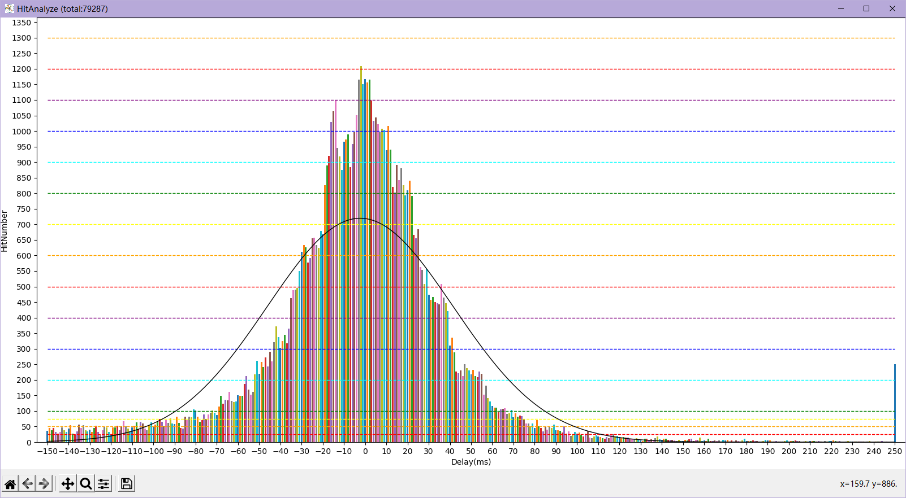

# 同步音律喵赛克 Steam端 存档解析工具
## 界面展示

## 未来的计划
- [ ] 提供全球排行榜显示功能
- [ ] 将提供一个文档来演示使用方法
- [ ] 使用文件夹内指定文件名的方式自定义美化UI
### 已完成的计划
- [x] 重排版SongName.json
- [x] 滑动条在重加载后保持位置不变
- [x] 隐藏cmd窗口
- [x] 将像Windows资源管理器一样使用列标题栏进行排序

## Release版本说明
NoConsole版本为没有命令提示符界面，适合正常使用

WithConsole版本为带命令提示符界面，适合出现bug时快速定位错误发生地点以及原因

### 功能控制模块
#### 在`./musync_data/`目录中创建指定文件名的无扩展名文件,即可启用/禁用对应功能
1. `UpdateDisable` 禁用更新检测
2. `AutoAutoAnalyze` 启用每次启动时强制重新扫描存档文件
3. `InjectionEnable` 启用DLL注入以开启高级功能
#### 其他功能组件
下列组件对游戏客户端有修改,请谨慎使用

*** $\colorbox{Red}{ 注意备份  注意备份  注意备份 }$ ***

$\color{Red}{请自行决定是否使用,使用过程中出现任何意外}$ *** $\colorbox{Red}{ 后果自负,开发者概不负责 }$ ***

HitDelay模块用法:启用DLL注入后,在本次游戏进行首次谱面游玩时会打开一个cmd窗口 *** $\color{Red}{请勿关闭该窗口}$ ***

- `HitDelayFix.dll` 被精心修改过的客户端文件,原始文件为`./MUSYNX_Data/Managed/Assembly-CSharp.dll`,如果想要使用,复制替换即可(记得备份原始文件).
- `HitDelayLine.py` 用于读取`./musync_data/HitDelay.log`中的击打信息生成可视化数据表,标题栏提供三个统计信息.
    - `AvgDelay` 平均击打延迟,即所有击打的平均值,能够一定程度上提示游戏延迟应该调整的数值(可能有较大偏差,仅供参考).
        比如游戏内判定补偿是+010ms,AvgDelay数值为-5ms,那么就应将游戏内判定补偿下调,但是具体需要调整多少请多次测试.
    - `AllKeys` 游戏进行了多少次判定,如果有长条中断,这个值会比游戏内真实按键数偏大.
    - `AvgAcc` 平均击打偏差,即所有击打的绝对值的平均值,该值总为正数.
        该值反应了您当前谱面本次游玩击打Key的时机的精准度,该值与您本次游玩的结算成绩有一定的关联:

        该值越小,就说明您击打的越精准,(在该值小于45ms时)分值就会越高.

## 更新日志
### Version 1.1.7
1. #### 更新 更新本次喵赛克更新的新曲目
2. #### 更新 对更新的DLL文件进行适配
3. #### 新增 新增一个统计所有击打的延迟的柱状图，在延迟分析页面的"All Hit"按钮
3. 修复些许bug(也许?)
4. 优化执行流程(也许?)

### Version 1.1.6
1. #### 修复 修复了对DLL注入时写入错误数据的bug
1. #### 新增 将DLL注入与详细延迟图表功能整合进主程序中，需要您具备一定的计算机操作能力才可启用
2. #### 更新 加大了表格内的字体大小，更护眼了
3. #### 新增 您的历史游玩记录可以在`./musync_data/HitDelayHistory.db`中查看
3. 修复些许bug(也许?)
4. 优化执行流程(也许?)
5. <del>这次打包大小咋突然翻了三倍??? 又nm什么原理🌿??？</del>

### Version 1.1.5
1. #### 更新 修改排除空白谱面的函数，使其更加自动化
    - 已找出空白谱面的规律: 加入收藏后会在收藏曲目的6KHD难度的编号+9位置产生一个空白谱面
2. #### 更新 `songname.json`
    - 更新曲目: Chivalric
1. #### 修复 修复了对"游玩计数"排序功能无法正确排序的bug
2. 修改少量函数名,使其更加贴近实现的功能
3. 整合本地功能函数库
3. 修复少量bug
4. 优化执行流程

### Version 1.1.4 rc2
- [x] 滑动条在重加载后保持位置不变
1. #### 新增 排除空白谱面
    - 排除的谱面编号为: `00018B01`,`00018C91`,`00018C93`,`0001B211`
2. #### 更新 补全当前版本所有SongName
3. #### 新增 增加版权到期排除谱面功能
    版权到期的曲目有：
    - 404 Not Found
    - ArroganT
    - TWINKLE STAR
    - 为你而来
    - 寓言预见遇见你的那刻
    - 星之伊始
    - 樂園 - Atlantis
    - 观星者
1. #### 新增 新增一个筛选按钮用于筛选谱面难度
    - (Easy | Hard | Inferno | All)
    - 默认为All
2. #### 新增 新增一个筛选按钮用于筛选谱面按键数
    - (4K | 6K | 4K&6K)
    - 默认为4K&6K
2. #### 新增 新增一个Label将上述两个按钮包裹在内(伪装成一个Frame(bushi))
3. 优化执行流程
4. 修复些许bug
5. <del>这次打包咋小了一半？？？什么原理🌿？</del>

### Version 1.1.3
- [x] 隐藏cmd窗口
- [x] 将像Windows资源管理器一样使用列标题栏进行排序
1. #### 移除 移除排序按钮
2. #### 新增 通过点击标题栏来进行排序显示
    - 升序:`▲`
    - 降序:`▼`
3. #### 更改 将程序生成的文件放置于`./musnyc_data/`中,让可执行文件所在目录不显得那么杂乱
4. #### 新增 文件选择功能增加扩展名限制
5. #### 更新 `SongName.json`的内容
6. #### 新增 从GitHub下载`SongName.json`文件
7. #### 修复 修复等待状态栏不能正常使用的bug
6. 更新 部分优化占用与卡顿
3. 修复 修复些许bug

### Version 1.1.2
1. #### 更改 发布可执行文件去掉了命令提示符框
2. #### 修复 修复了第一次启动时json文件报错的bug

### Version 1.1.1
1. #### 修复 修复某些bug
2. #### 更改 更改SongName数据表的键名
    - 将小端键名替换为大端
3. #### 更改 更改"未游玩"筛选的判定条件
    - 现在"未游玩"的判定条件为: 游玩计数和本地同步率同时为0

### Version 1.1.0
1. #### 更改 更改判定一条存储内容是哪首歌哪个谱面的方式
    - 已通过(本人的)多版本存档验证
    - 缺少更多的存档进行更多的测试
2. #### 更改 修改Json文件的内容

### Version 1.0.7
1. #### 新增 排除空谱面
    1. 排除0935号谱面ID 原因 该编号未被分配
    2. 排除1022号谱面ID 原因 该编号未被分配
    2. 排除1194号谱面ID 原因 该编号未被分配
    2. 排除1283号谱面ID 原因 该编号未被分配
    2. 排除1342及更高的谱面ID 原因 该编号未被分配
2. #### 修复 歌曲收藏功能异常
    游戏中"收藏"功能仅标记4K Easy难度，目前实现自动对其他难度在分析文件中同时添加标记
3. #### 修复 打开错误的`SavAnalyze.json`文件导致异常闪退的问题
    现在将会自动删除错误文件并重新生成
    如果生成错误，有可能会再次闪退

### 再次申明：妾身`不会`对存档文件进行`写`操作

### Version 1.0.6
1. #### 新增 通过"云端同步率"计算"综合同步率"
2. #### 更改 排序控件
    1. "本地同步率"改为"云端同步率"
3. #### 更改 筛选控件
    1. "Score>122%"改为"黑Ex"
    2. "Score>120%"改为"红Ex"

### Version 1.0.5
1. #### 新增 谱面排序功能
    - 灰色(#F0F0F0)表示未启用该排序方法
    - 绿色(#98E22B)表示已启用该排序的倒序方法
    - 红色(#FF7B7B)表示已启用该排序的正序方法
    1. 按 游玩次数 排序
    2. 按 难度等级 排序
    3. 按 本地同步率 排序
    1. 按 名称 排序
2. #### 新增 谱面筛选按钮增加背景颜色启用标识
    - 灰色(#F0F0F0)表示未启用该筛选方法
    - 绿色(#98E22B)表示已启用该筛选方法
3. #### 新增 谱面筛选功能与谱面排序功能可同时使用
4. #### 更改 筛选控件与排序控件的排版大幅度改动

### Version 1.0.4
1. #### 新增 双击谱面打开新窗口爬取全球数据(未找到排行榜链接)
2. #### 更新 "SongName.json"文件
3. #### 新增 谱面难度等级列
3. #### 更改 谱面难度列分拆为"键数"列和"难度"列

### Version 1.0.3
1. #### 更新 "SongName.json"文件
2. #### 新增 启动状态指示Label

### Version 1.0.2
2. #### 更改 窗口宽高自动识别频率为200ms
1. #### 新增 新版本提示颜色闪烁，改变时间为500ms
3. #### 新增 自动从GitHub Repo获取"./SongName.json"文件
4. #### 新增 自动从"FileExport.py"释放"霞鹜文楷等宽"字体和图标文件

### Version 1.0.1
1. #### 新增 开发者Label和更新获取通道
1. #### 新增 前往GitHub页面的Button
1. #### 新增 第二次及之后的分析会自动读取"./SavAnalyze.json"分析缓存
1. #### 新增 通过读取"./SongName.json"来填充"./SavAnalyze.json"中`SongName`字段

### Version 1.0.0
1. #### 新增 简易自动搜索存档文件
    首次运行时自动搜索每个磁盘的
    1. `./Program Files/steam/steamapps/common/MUSYNX/SavesDir/savedata.sav`
    2. `./SteamLibrary/steamapps/common/MUSYNX/SavesDir/savedata.sav`
    3. `./steam/steamapps/common/MUSYNX/SavesDir/savedata.sav`
    三个目录
2. #### 新增 可以按固定方式筛选谱面
    1. `筛选出 已游玩`
    2. `筛选出 未游玩`
    3. `筛选出 已收藏`
    4. `筛选出 成绩大于122%(即黑EX)`
    5. `筛选出 成绩大于120%(即红EX)`
    6. `按Rank评级: EX、S、A、B、C筛选`
3. #### 新增 允许使用"打开存档"按钮进行文件选择
4. #### 新增 显示当前已筛选出的谱面数量
5. #### 新增 使用红色"重新分析"按钮清除分析缓存并重新生成
6. #### 新增 窗口控件自动跟随窗口大小改变
7. #### 新增 在窗口标题栏显示最后一次游玩曲名