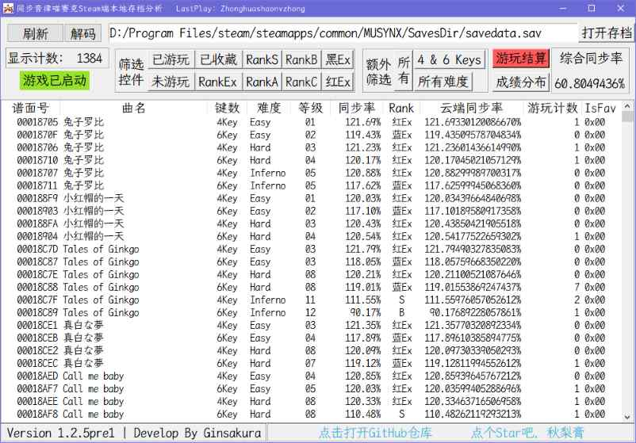
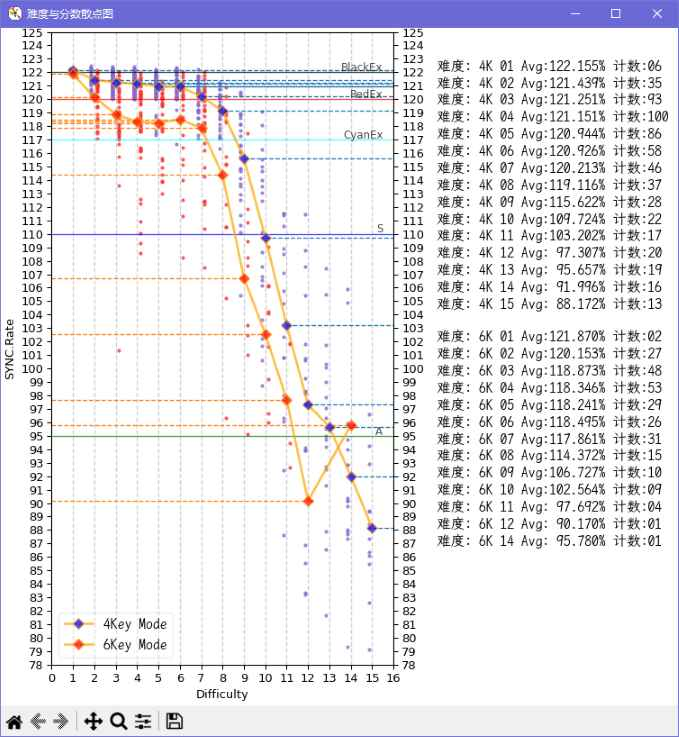
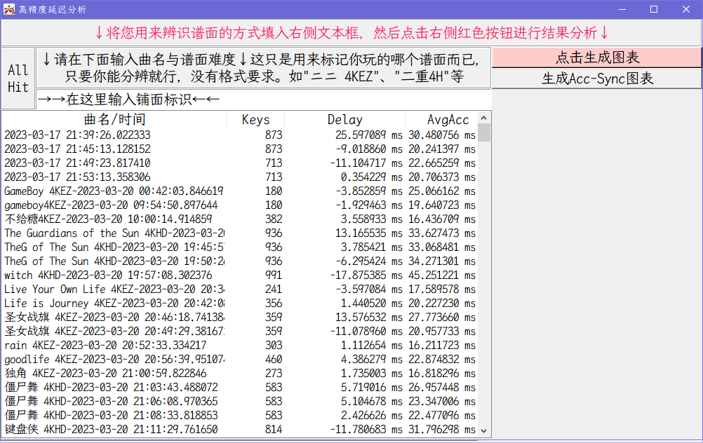
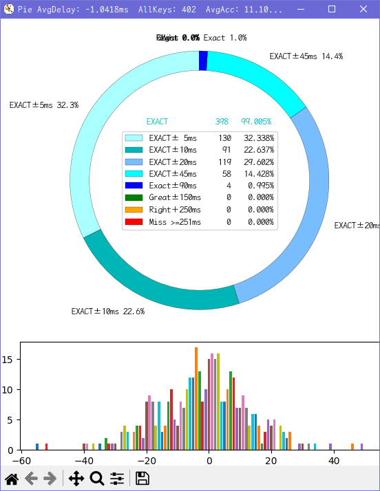
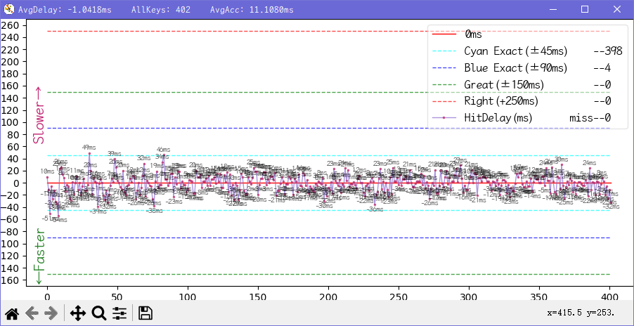
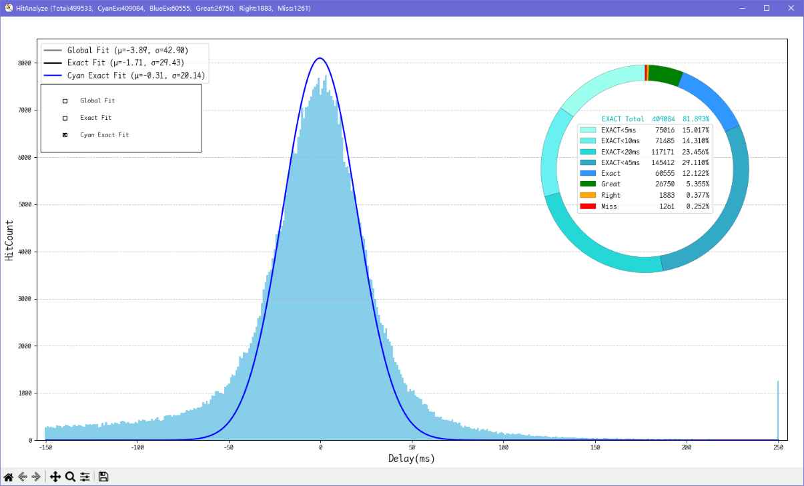
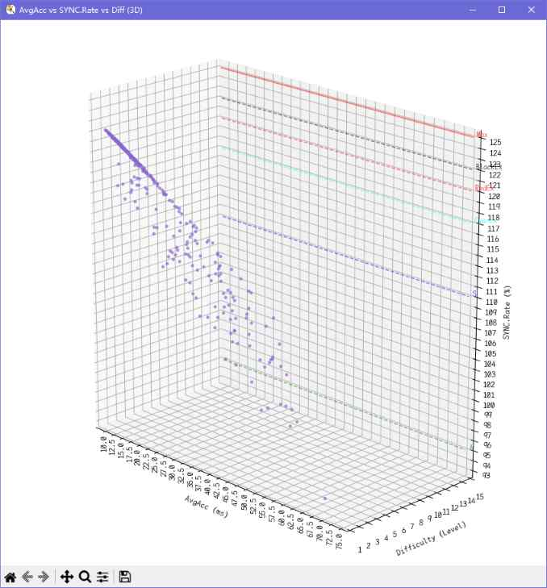

# 同步音律喵赛克 Steam端 存档解析工具
MUSYNX Steam Client Savefile Decode & Analyze Tool

~~C#重构版本: [MUSYNCSaveCSharp](https://github.com/Ginsakura/MUSYNCSaveCSharp)~~

[down_svg]: https://img.shields.io/github/downloads/ginsakura/MUSYNCSave/total?label=All%20Downloads
[all_release]: https://github.com/Ginsakura/MUSYNCSave/releases
[commit_svg]: https://img.shields.io/github/commit-activity/t/ginsakura/MUSYNCSave?label=All%20Commits
[commit]: https://github.com/Ginsakura/MUSYNCSave/commits
[license_svg]: https://img.shields.io/github/license/ginsakura/MUSYNCSave?label=License
[![All releases][down_svg]][all_release]
[![All commit activity (branch)][commit_svg]][commit]
[![License][license_svg]](./LICENSE)

[latest_prerelease_svg]: https://img.shields.io/github/v/release/ginsakura/MUSYNCSave?display_name=release&label=Latest%20PreRelease&include_prereleases
[all_tags]: https://github.com/Ginsakura/MUSYNCSave/tags
[![Latest tag][latest_prerelease_svg]][all_tags]

[latest_release_svg]: https://img.shields.io/github/v/release/ginsakura/MUSYNCSave?display_name=release&label=Latest%20Release
[release]: https://github.com/Ginsakura/MUSYNCSave/releases/latest
[![latest release][latest_release_svg]][release]

---

## 目录 (Table of Contents)
* [使用说明 (How to use)](#使用说明-how-to-use)
* [界面展示](#界面展示)
* [开发计划](#开发计划)
  * [未来的计划](#未来的计划)
  * [进行中的计划](#进行中的计划)
  * [已完成的计划](#已完成的计划)
* [版本发布说明](#版本发布说明)
* [功能控制模块](#功能控制模块)
  * [高级功能简介](#高级功能简介)
* [更新日志](#更新日志)
  * [Version 3.0.0](#version-300)
* [郑重声明](#郑重声明)

---

## 使用说明 (How to use)

1. [English (English, `en-us`) v3.0.0](./ReadmeResources/How_to_use.en.md)
2. [简体中文 (Simplified Chinese, `zh-cn`) v3.0.0](./ReadmeResources/How_to_use.zh.md)

## 界面展示

点击展开界面展示

## 软件调用结构

点击展开软件调用结构

## 开发计划

### 未来的计划
- [ ] ( 0% ) 提供全球排行榜显示功能 (需要调用 Steam API)
- [ ] ( 0% ) 使用文件夹内指定文件名的方式自定义美化 UI

### 进行中的计划
- [ ] ( 0% ) 使用 mod 加载器代替 DLL 注入 ([[1]](www.kimi.com/share/19b65045-1262-8dd7-8000-000083def80e))
- [ ] ( 80% ) 使用 UDP 通信代替 UIAutomation 进行结果获取

### 已完成的计划

点击查看已完成的详细信息

- [x] 主程序目录通过 exe 文件进行判断
- [x] 将提供一个文档来演示使用方法 (在写了, 咕咕咕)
- [x] 一键获取上次谱面游玩结果
- [x] 使用 GitHub Action workflow 实现自动分发
- [x] 重排版 `SongName.json`
- [x] 滑动条在重加载后保持位置不变
- [x] 隐藏 cmd 窗口
- [x] 将像 Windows 资源管理器一样使用列标题栏进行排序
- [x] 将高级功能整合为 `ExtraFunction.cfg` 配置文件
- [x] 日志工具提上日程

---

## 版本发布说明
* **NoConsole 版本**：没有命令提示符界面，适合日常正常使用。
* **WithConsole 版本**：带有命令提示符界面，适合出现 bug 时快速定位错误发生地点以及原因。

## 功能控制模块

点击查看控制参数详解

> 于 `./musync_data/bootcfg.json` 文件中启用/禁用对应功能。

| 配置项 | 默认值 | 值类型 | 配置说明 |
| :--- | :--- | :--- | :--- |
| `Version` | `自动获取` | string | 记录当前工具的版本号 |
| `LoggerFilter` | `'INFO'` | string | 控制台日志输出的最低过滤等级 |
| `CheckUpdate` | `false` | boolean | 是否启用自动检查更新 |
| `DllInjection` | `false` | boolean | 是否启用 DLL 注入以开启**高级功能** |
| `PlayedScatterAvgAccWindowSize` | `0` | int | HitDelay中散点图中`移动平均趋势线`的窗口大小, 0表示自动计算, 1表示逐点折线图(参考旧图), 建议在5~30之间 |
| `SystemDPI` | `自动获取` | string | 读取系统 DPI，提供 DPI 窗体修正 (未实现) |
| `DonutChartinHitDelay` | `false` | boolean | 是否在单次游玩统计中显示击打延迟环形图 |
| `DonutChartinAllHitAnalyze` | `false` | boolean | 是否在全局统计中显示击打延迟环形图 |
| `NarrowDelayInterval` | `true` | boolean | 是否在单次游玩统计中使用更狭窄的击打区间来计算平均偏移值 (Delay) `true` = ±45ms, `false` = ±90ms |
| `ConsoleAlpha` | `75` | int | 游戏控制台窗口的不透明度 (取值范围 [0,100]，100 为完全不透明，不建议低于 30) |
| `ConsoleFont` | `'霞鹜文楷等宽'` | string | 游戏控制台窗口的字体 |
| `ConsoleFontSize` | `36` | int | 游戏控制台窗口的字号 |
| `MainExecPath` | `自动获取` | string | 游戏主程序所在的绝对路径 |
| `ChangeConsoleStyle` | `false` | boolean | 是否启用自定义喵赛克游戏本体控制台窗口样式 |

### 高级功能简介

下列组件对游戏客户端有直接修改，请谨慎使用。

> **⚠️ 警告：核心文件修改，请务必提前备份！注意备份！注意备份！**
> 
> **免责声明**：请自行决定是否使用，使用过程中出现任何意外导致的数据丢失或封号，后果自负，开发者概不负责。

**HitDelay 模块用法：**
启用 DLL 注入后，在本次游戏进行首次谱面游玩时，会打开一个 cmd 窗口用于实时显示击打延迟，
**请勿关闭该窗口**，关闭该控制台窗口会导致游戏一并退出，不想看可以将其最小化。

`HitDelay.py`：用于读取控制台中的击打信息并生成可视化数据表，标题栏提供以下三个维度的统计信息：
* **AvgDelay (平均击打延迟)**：即所有击打的平均值，能够一定程度上提示游戏延迟应该调整的数值（可能有较大偏差，仅供参考）。例如：游戏内判定补偿是 `+010ms`，AvgDelay 数值为 `-5ms`，那么就应将游戏内判定补偿减少 5ms。具体调整幅度请多次实测。
* **Notes (总按键数)**：谱面中存在 note 的总数目。
* **Combo (连击数)**：本次游玩的Combo和FullCombo。
* **AvgAcc (平均击打偏差)**：即所有击打的绝对值的平均值，该值总为正数。该值反映了您当前谱面本次游玩击打 Key 时机的精准度，与本次游玩的结算成绩密切相关：**该值越小，说明击打越精准**（当该值小于 45ms 时，您的分值就会越高）。

## 更新日志
### Version 3.0.1
<!--1. 更新-->
1. 修复
    
1. 优化
    1. 

### Version 3.0.0
1. 更新
    1. ***更新2026年02月14日喵赛克联动新增曲目***
        - Miss You (EZ HD)
        - Rainbow (EZ HD)
    1. ***更新2026年04月03日喵赛克联动新增曲目***
        - Vacant Gloria (EZ HD)
        - Memory Accelerator (EZ HD)
2. 修复
    1. 修复重构产生的各种 bug
3. 优化
    1. 更改数据库结构，增加模式、难度、连击字段 (v3 -> v4)
    2. 深度重构代码，使其全面符合 `PEP 8` 规范
    3. 优化 patch 用 C# 代码，关闭控制台的 `快速编辑` 模式；
    3. 控制台提供更丰富的数据输出
    3. 优化`Tookit`中数据库升级迁移逻辑
    3. 优化游戏启动监测逻辑, 降低资源占用
4. 重构
    1. `AllHitAnalyze`: 优化底层数据处理逻辑与图表渲染性能展示
    2. `AvgAcc-SyncAnalyze`: 引入 `Diff` 轴映射，将平面图表重构为 3D 景深散点图
    3. `Diffculty_ScoreAnalyze`: 以更现代、更解耦的架构重新绘制图表并展示数据
    4. `FileEncoding`: 引入防溢出屏障，以更安全的方式处理文件的 meta data，确保跨平台文件操作与 I/O 安全性
    5. `Toolkit`: 完善了文件哈希校验、资源释放的并发安全性设计，并封装了安全的 SQLite 事务流转
    6. `Resource`: 拆分模块, 将其拆分为`config_manager`, `map_info`, `songname_manager`, `save_data_manager`三个独立模块
    7. `bootcfg.json`: 缩减配置项
    7. `HitDelay`: 完全重构代码和界面, 适配最新的(v4)数据库和游戏控制台输出内容

### 旧版本更新日志
#### [旧版本更新日志 (2.0.0 - 2.1.0)](./ReadmeResources/OldVersionUpdateLog.md#旧版本更新日志-200---210)
#### [旧版本更新日志 (1.0.0 - 1.2.8rc5)](./ReadmeResources/OldVersionUpdateLog.md#旧版本更新日志-100---128rc5)
---

## 郑重声明：我 **不会** 对存档文件进行任何 **写** 操作
